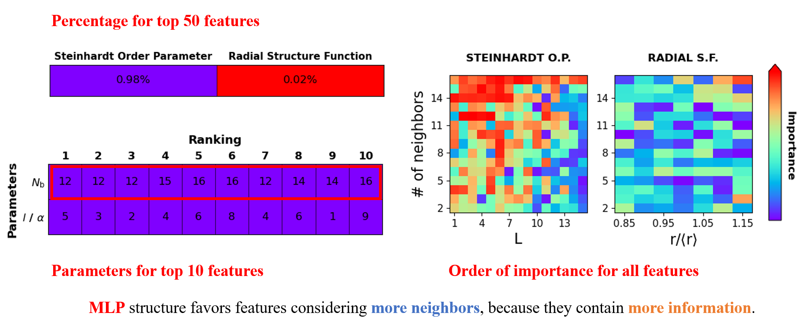
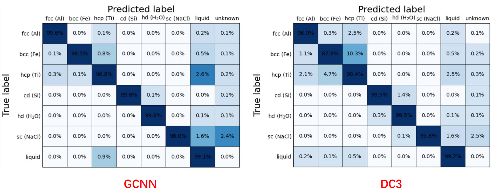

Post-processing of atomistic simulation data with graph convolutional neural network (GCNN) and embedding feature engineering strategy.
-	Used graph convolution neural network as a classifier to identify local crystal structure in simulations, reducing the error rate by 2-5 times for different structures.
-	Used feature engineering to reduce the computational cost by about 3 times, narrowing the gap of time cost between our algorithm and heuristic algorithms.

[See more details here]()

