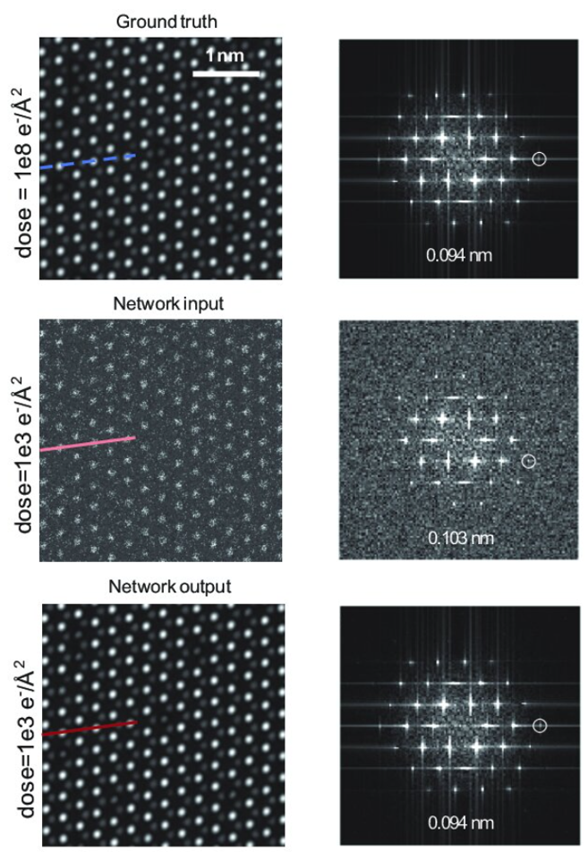

This paper is about an unsupervised denoising method used for low-dose imaging.

[Download paper here](https://www.researchgate.net/publication/370049095_Low-dose_imaging_denoising_with_one_pair_of_noisy_images)

