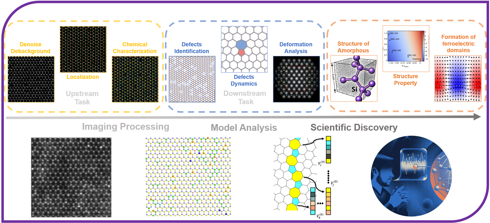
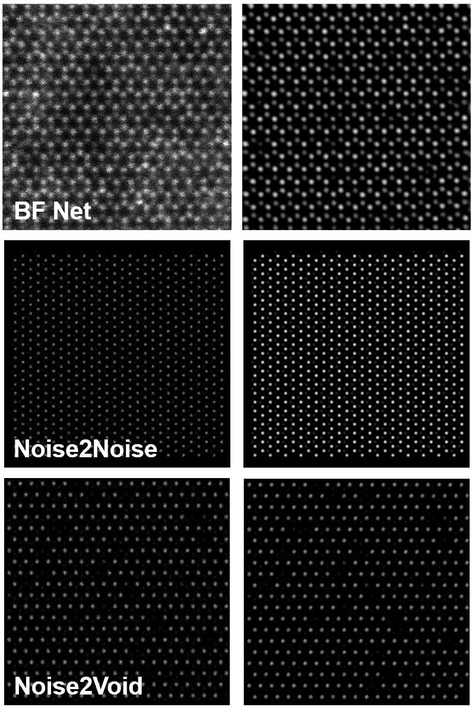
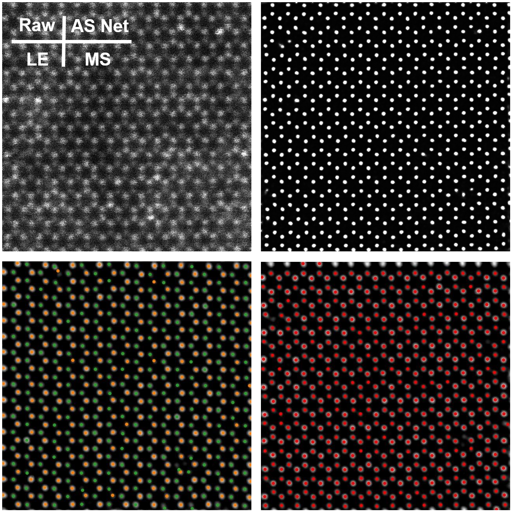
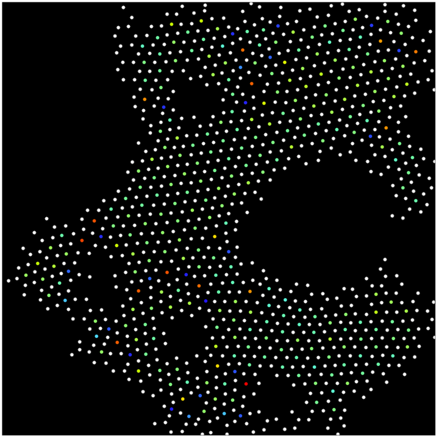

DeepSTEM is an open-source AI copilot for STEM Z-Contrast imaging and STEM-EELS data processing and analysis.

-	High-precision chemical characterization with scanning transmission electron microscopy
-	Structural analysis and physical properties of amorphous monolayer carbon: r-VAE method
-	Isotope discrimination with atomic resolution: EELS denoising with machine learning

[See more details here](https://github.com/dxz222/DeepSTEM)

STEM Overview
---

Denoising Performance
---

Localization Performance
---

Rediscovery of Ring Types in Amorphous Carbon
---

