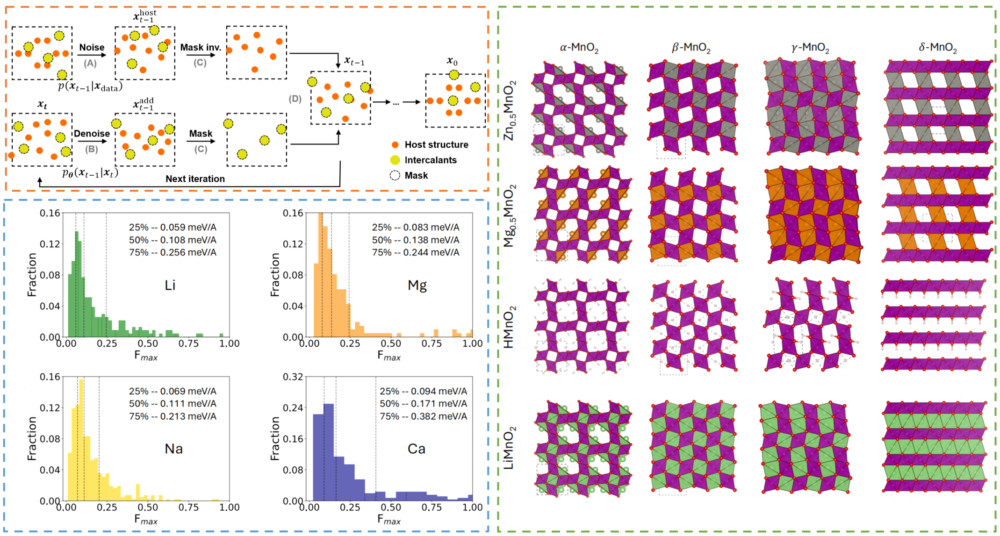

This study applies an SE(3)-equivariant diffusion model, pre-trained on the Materials Project database, to efficiently predict intercalant positions in host structures for energy storage materials design using the inpainting method.

### Abstract:
Searching for the optimal atomic position of additive atoms in a given host structure is crucial in designing materials with intercalation chemistry for energy storage. In this study, we present an application of the SE(3)-equivariant diffusion model for such conditional crystal structure predictions using inpainting methods. The model, built upon the e3nn framework, was pre-trained on the Materials Project structure database via denoising score matching. By solving the reverse stochastic differential equation using the predictor-corrector method, the model is capable of all-atom crystal generation as well as conditional generation – finding atomic sites of additive atoms within a host structure. We benchmarked the model performance on the WBM dataset and showcased examples of ion intercalation in different MnO$_2$ polymorphs. This efficient, probabilistic site-finding tool offers the potential for accelerating the materials discovery.

- Developed a cutting-edge SE(3)-equivariant diffusion model for crystal structure generation.
- Achieved high accuracy in predicting intercalant positions, with over 80% reconstruction rate for Li, Na, Mg, and Ca intercalants.
- Demonstrated applications for battery materials, specifically MnO$_2$ polymorphs.
- Validated results with CHGNet and DFT, confirming minimal interatomic forces and energy deviations for inpainted structures.

[Download paper here](https://openreview.net/pdf?id=T1mIt5exUF)

