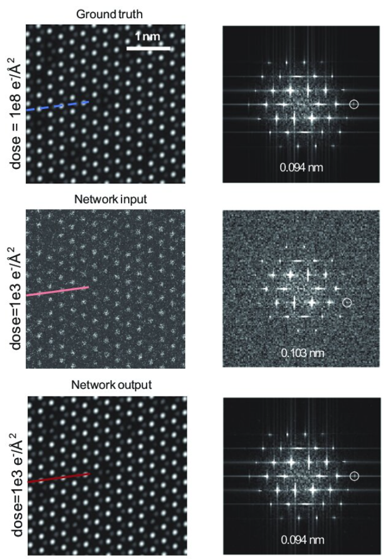

This study applies an SE(3)-equivariant diffusion model, pre-trained on the Materials Project database, to efficiently predict intercalant positions in host structures for energy storage materials design using the inpainting method.

### Abstract:
Searching for the optimal atomic position of additive atoms in a given host structure is crucial for designing materials with intercalation chemistry, particularly for energy storage applications. In this study, we present an SE(3)-equivariant diffusion model for conditional crystal structure predictions using inpainting methods. The model, built on the e3nn framework, was pre-trained on the Materials Project database and benchmarked on the WBM dataset, showcasing successful predictions of ion intercalation in MnO2 polymorphs. This tool offers an efficient and probabilistic approach to accelerating materials discovery.

- Developed a cutting-edge SE(3)-equivariant diffusion model for crystal structure generation.
- Achieved high accuracy in predicting intercalant positions, with over 80% reconstruction rate for Li, Na, and Mg intercalants.
- Demonstrated applications for battery materials, specifically MnO2 polymorphs.
- Validated results with CHGNet and DFT, confirming minimal interatomic forces and energy deviations.

[Download paper here](https://openreview.net/pdf?id=T1mIt5exUF)

