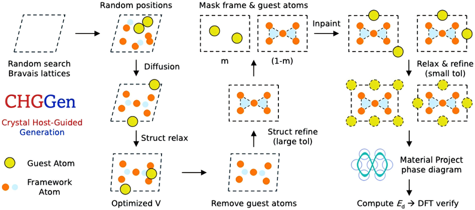

This study develops the **Crystal Host-Guided Generation (CHGGen)** framework, which applies inpainting methods from computer vision to crystal structure prediction. Instead of generating complete structures unconditionally, CHGGen optimizes atomic positions within **predefined, symmetrized host lattices**, thereby improving long-range crystallographic order.

The model is integrated with a **foundation potential** for structure relaxation, enabling both structure discovery and structural modification of systems with partial occupancy or intercalation chemistry. Benchmarking on **ZnS–P₂S₅** and **Li–Si** chemical systems shows that CHGGen produces a higher fraction of symmetric structures than unconditional diffusion models.

This conditional generative approach provides a versatile, modular tool for **accelerating materials discovery**, particularly in domains like **battery materials**.

This study applies an SE(3)-equivariant diffusion model, pre-trained on the Materials Project database, to efficiently predict intercalant positions in host structures for energy storage materials design using the inpainting method.

- Introduced CHGGen, a host-guided inpainting framework for crystal structure generation.
- Overcame the locality bias of graph neural network diffusion models by enforcing host-symmetry constraints.
- Achieved higher success in generating symmetric and chemically plausible structures for complex polyanion systems.
- Demonstrated versatility for structural modification in partial occupancy and intercalation contexts.
- Integrated with foundation potentials (e.g., CHGNet) to validate structural stability with low interatomic forces and minimal energy deviation.

[Download paper here](https://pubs-rsc-org.proxy.library.cornell.edu/en/content/articlelanding/2025/mh/d5mh00774g/unauth)

